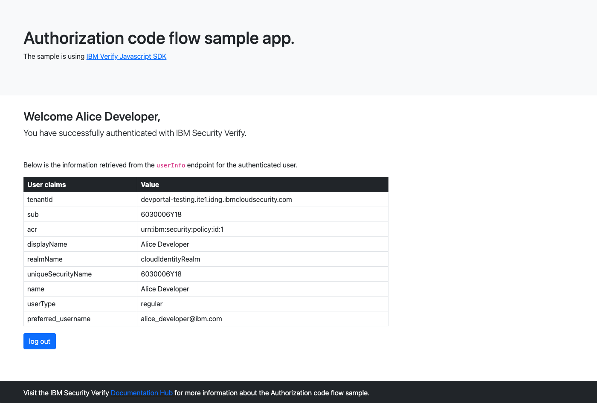

# Node sample application using Authorization grant type
This sample shows how to use the SDK to
* Authenticate a user via IBM Security Verify
* View user information via `userinfo` endpoint

 

To run the sample

- Copy paste the contents of the `.env.example` file into a `.env` file
- Update the environment variables in your `.env` file with the appropriate configuration settings.
- npm install
- npm start
- navigate to `http://localhost:3000`

The IBM Verify Javascript SDK also supports the ability to manage IBM Verify registration profiles. You can read more about how this is implemented [here](http://developer.ice.ibmcloud.com/verify/javascript/ibm-verify-sdk-object-model/authenticator-context)

## License

The MIT License (MIT)

Copyright (c) 2019, 2020 IBM

Permission is hereby granted, free of charge, to any person obtaining a copy of this software and associated documentation files (the "Software"), to deal in the Software without restriction, including without limitation the rights to use, copy, modify, merge, publish, distribute, sublicense, and/or sell copies of the Software, and to permit persons to whom the Software is furnished to do so, subject to the following conditions:

The above copyright notice and this permission notice shall be included in all copies or substantial portions of the Software.

THE SOFTWARE IS PROVIDED "AS IS", WITHOUT WARRANTY OF ANY KIND, EXPRESS OR IMPLIED, INCLUDING BUT NOT LIMITED TO THE WARRANTIES OF MERCHANTABILITY, FITNESS FOR A PARTICULAR PURPOSE AND NONINFRINGEMENT. IN NO EVENT SHALL THE AUTHORS OR COPYRIGHT HOLDERS BE LIABLE FOR ANY CLAIM, DAMAGES OR OTHER LIABILITY, WHETHER IN AN ACTION OF CONTRACT, TORT OR OTHERWISE, ARISING FROM, OUT OF OR IN CONNECTION WITH THE SOFTWARE OR THE USE OR OTHER DEALINGS IN THE SOFTWARE.