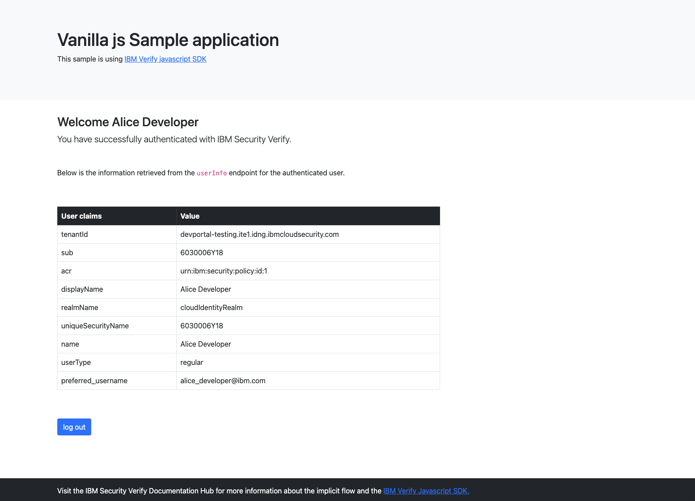

# Vanilla JS Sample

This sample shows how to use the IBM Security Verify SDK for JavaScript to:
- Authenticate a user via IBM Security Verify platform.
- Successfully make an API request to `userinfo` endpoint to return the authenticated users details.

 

## :rocket: Demo the sample app:
**If you've downloaded a sample application via the developer portal you can proceed to step 4** :relieved:
1. Update the Config object in `front-end/config.js` with the appropriate configuration settings.
2. Update the Config object in `vanilla/config.js` with the appropriate configuration settings.
3. Transpile `browserify front-end/dashboard.js > front-end/dashboard-transpile.js`
4. npm install
5. npm run start
6. navigate to `http://localhost:3000` in your browser

This sample application uses [Implicit Flow](http://developer.ice.ibmcloud.com/verify/javascript/oauth/implicit-flow) to authenticate a user.

The IBM Verify Javascript SDK also supports the ability to manage IBM Verify registration profiles. You can read more about how this is implemented [here](http://developer.ice.ibmcloud.com/verify/javascript/ibm-verify-sdk-object-model/authenticator-context)

# Node.js

Handles routing to the file `dashboard.html`, a web server is required to use the SDK.

# Front-end

All of the logic is contained in the file `front-end/dashboard.js` it handles the authentication, token storage and sending requests to your application.

## License

The MIT License (MIT)

Copyright (c) 2019, 2021 - IBM Corp.

Permission is hereby granted, free of charge, to any person obtaining a copy of this software and associated documentation files (the "Software"), to deal in the Software without restriction, including without limitation the rights to use, copy, modify, merge, publish, distribute, sublicense, and/or sell copies of the Software, and to permit persons to whom the Software is furnished to do so, subject to the following conditions:

The above copyright notice and this permission notice shall be included in all copies or substantial portions of the Software.

THE SOFTWARE IS PROVIDED "AS IS", WITHOUT WARRANTY OF ANY KIND, EXPRESS OR IMPLIED, INCLUDING BUT NOT LIMITED TO THE WARRANTIES OF MERCHANTABILITY, FITNESS FOR A PARTICULAR PURPOSE AND NONINFRINGEMENT. IN NO EVENT SHALL THE AUTHORS OR COPYRIGHT HOLDERS BE LIABLE FOR ANY CLAIM, DAMAGES OR OTHER LIABILITY, WHETHER IN AN ACTION OF CONTRACT, TORT OR OTHERWISE, ARISING FROM, OUT OF OR IN CONNECTION WITH THE SOFTWARE OR THE USE OR OTHER DEALINGS IN THE SOFTWARE.