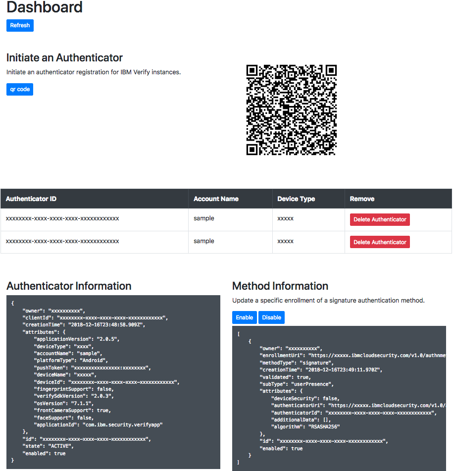

# Node.js Sample

This sample shows how to use the SDK to 
* Authenticate a user through Cloud Identity
* Initiate an authenticator registration
* Query the user's authenticators
* Query an authenticator's methods
* Delete an authenticator
* Disable an authenticator's method

 

To run the example 

- Copy paste the contents of the `.env.example` file into a `.env` file
  - Update the environment variables in your `.env` file with the appropriate configuration settings.
- npm install
- npm start
- navigate to `http://localhost:3000/login` in your browser

# Node.js

Handles the user authenticating through Cloud Identity and stores the token. Use a database when implementing this yourself it was omitted for the sake of simplicity. 

Several express routes are defined, which call functions in the SDK and return the response to the user.

| Method | Route | Function called |
|--------|-------|-----------------|
| GET | /login | OAuthContext.authenticate()| 
| GET | /authorize/callback| OAuthclient.getToken()|
| GET | /logout | |
| GET | /api/authenticators | AuthenticatorContext.authenticators() |
| GET | /api/registration | AuthenticatorContext.initiateAuthenticator() |
| GET | /api/methods/:authenticatorId| AuthenticatorContext.methods() |
| GET | /api/methods/:authenticatorId| AuthenticatorContext.methods() |
| PATCH | /api/method/enabled |AuthenticatorContext.methodEnabled() |
| DELETE | /api/authenticator | AuthenticatorContext.deleteAuthenticator() |

# Front-end

The front end is accessed at `/dashboard.html`, the front-end sends requests to Node via JQuery, Node then sends a request to your Cloud Identity application using the clients token and sends the result back to the front-end.

## License

The MIT License (MIT)

Copyright (c) 2019 IBM

Permission is hereby granted, free of charge, to any person obtaining a copy of this software and associated documentation files (the "Software"), to deal in the Software without restriction, including without limitation the rights to use, copy, modify, merge, publish, distribute, sublicense, and/or sell copies of the Software, and to permit persons to whom the Software is furnished to do so, subject to the following conditions:

The above copyright notice and this permission notice shall be included in all copies or substantial portions of the Software.

THE SOFTWARE IS PROVIDED "AS IS", WITHOUT WARRANTY OF ANY KIND, EXPRESS OR IMPLIED, INCLUDING BUT NOT LIMITED TO THE WARRANTIES OF MERCHANTABILITY, FITNESS FOR A PARTICULAR PURPOSE AND NONINFRINGEMENT. IN NO EVENT SHALL THE AUTHORS OR COPYRIGHT HOLDERS BE LIABLE FOR ANY CLAIM, DAMAGES OR OTHER LIABILITY, WHETHER IN AN ACTION OF CONTRACT, TORT OR OTHERWISE, ARISING FROM, OUT OF OR IN CONNECTION WITH THE SOFTWARE OR THE USE OR OTHER DEALINGS IN THE SOFTWARE.